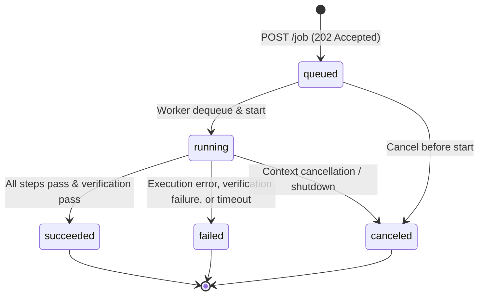

# Job Lifecycle

This document describes the lifecycle states, transitions, and status inspection
semantics for jobs submitted to the Parametron Engine API.

## Lifecycle State Machine



### States

| State | Terminal? | Description |
|-------|-----------|-------------|
| `queued` | No | Job has been validated, canonicalized, and enqueued. Not yet executing. |
| `running` | No | A background runtime worker is actively executing the job. |
| `succeeded` | Yes | All steps completed successfully and Engine verification passed. |
| `failed` | Yes | A step execution failed, verification rejected the run, or step timeout elapsed. |
| `canceled` | Yes | Execution was canceled before or during execution. |

Once a job enters a terminal state (`succeeded`, `failed`, or `canceled`), its
state is immutable and does not transition further.

## Status Inspection

Job state is queried via `GET /job/{id}`:

```http
GET /job/291a134a65b3dd43644f08e49339e31d8717d3d2c88f1dc21b34e55e88863aa9
```

### Succeeded Job Response

```json
{
  "schemaVersion": "1.0",
  "jobId": "291a134a65b3dd43644f08e49339e31d8717d3d2c88f1dc21b34e55e88863aa9",
  "productKey": "bracket",
  "state": "succeeded",
  "createdAt": "2026-09-13T14:00:00Z",
  "updatedAt": "2026-09-13T14:00:05Z",
  "startedAt": "2026-09-13T14:00:01Z",
  "endedAt": "2026-09-13T14:00:05Z"
}
```

### Failed Job Response (Structured Failure)

```json
{
  "schemaVersion": "1.0",
  "jobId": "291a134a65b3dd43644f08e49339e31d8717d3d2c88f1dc21b34e55e88863aa9",
  "productKey": "bracket",
  "state": "failed",
  "createdAt": "2026-09-13T14:00:00Z",
  "updatedAt": "2026-09-13T14:00:04Z",
  "startedAt": "2026-09-13T14:00:01Z",
  "endedAt": "2026-09-13T14:00:04Z",
  "error": {
    "message": "observed metadata \"working_copy_sha256\" mismatch",
    "productId": "bracket",
    "stepId": "2",
    "retryCount": 0,
    "timeout": false,
    "canceled": false,
    "classification": "metadata_mismatch",
    "boundary": "engine",
    "category": "verification",
    "code": "metadata_mismatch",
    "stage": "verification_comparison",
    "attemptId": "freecad-attempt-1"
  }
}
```

### Status Schema Fields

| Field | Type | Description |
|-------|------|-------------|
| `schemaVersion` | string | Schema version (`"1.0"`). |
| `jobId` | string | Deterministic canonical job identifier. |
| `productKey` | string | Product key associated with the job. |
| `state` | string | Current lifecycle state (`queued`, `running`, `succeeded`, `failed`, `canceled`). |
| `createdAt` | string | ISO 8601 UTC timestamp of submission. |
| `updatedAt` | string | ISO 8601 UTC timestamp of latest state update. |
| `startedAt` | string | ISO 8601 UTC timestamp when execution began (omitted if not yet started). |
| `endedAt` | string | ISO 8601 UTC timestamp when execution ended (omitted if not terminal). |
| `error` | object | Failure structure (omitted on non-terminal states and success). |

### Failure Structure Fields

| Field | Type | Description |
|-------|------|-------------|
| `message` | string | Human-readable error description. |
| `productId` | string | Product where the error occurred. |
| `stepId` | string | Step index where execution halted. |
| `retryCount` | integer | Number of retries attempted. |
| `timeout` | boolean | `true` if failure was caused by step timeout. |
| `canceled` | boolean | `true` if failure was caused by cancellation. |
| `classification` | string | Verification or failure classification code (optional). |
| `boundary` | string | Failure boundary (e.g. `engine` or runtime; optional). |
| `category` | string | Failure category (e.g. `verification`, `runtime`; optional). |
| `code` | string | Machine-readable failure code (optional). |
| `stage` | string | Pipeline stage where failure occurred (optional). |
| `attemptId` | string | Attempt identifier during which failure occurred (optional). |

## Timeout, Failure, and Cancellation Semantics

- **Timeout**: Step timeouts trigger step execution termination. The job status
  transitions to `state: "failed"` with `error.timeout = true`.
- **Cancellation**: Context cancellation (such as SIGINT during execution) triggers
  clean termination of subprocesses. The job status transitions to
  `state: "canceled"` with `error.canceled = true`.
- **Verification failure**: If external CAD execution succeeds but Engine
  verification rejects the observed evidence, the job transitions to
  `state: "failed"`. No verified artifacts are registered into the artifact store.

## Terminal Report Publication

Before publishing a terminal job state (`succeeded`, `failed`, or `canceled`), the
runtime attempts to construct and write an execution report (`report.json`) to the
job product directory.

> [!NOTE]
> Report writing is non-blocking to the lifecycle transition: if the report write
> fails due to an I/O error, the error is logged and discarded, and the job status
> still transitions to its terminal state. Terminal status therefore does not
> guarantee that a report file was written successfully to disk.

## Store Persistence

The default `parametron-engine` server uses an in-memory submission store. Job
lifecycle records reside in memory for the duration of the server process and do
not survive server restart.

## Related Documents

- [Job Submission](job-submission.md) — How jobs are submitted and registered.
- [Job Artifacts](job-artifacts.md) — Querying artifacts produced by a succeeded job.
- [API Overview](api-overview.md) — Endpoints and HTTP server configuration.
- [Reporting](reporting.md) — Run-level `report.json` schema and contracts.
